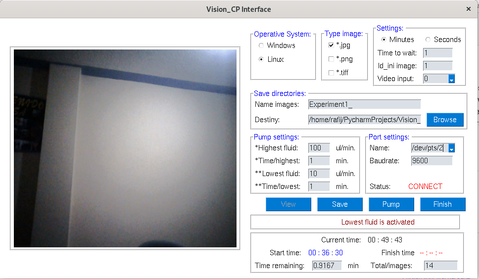

# Vision MT
Vision MT using **Multi threads** is a GUI Interface programmed in *PYTHON* using PySimpleGUI to control 2 different processes divided in 2 different threads to avoid errors.
* One process is to turn on webcam and save images according to wait time parameter setted by user.
* Another one is to control an external device. In this case a pump used in biological experiments to inyect a chemical substance with different speeds and wait time. 

This is a test version 0.1.3

